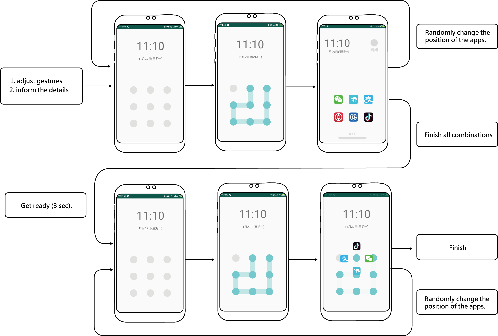
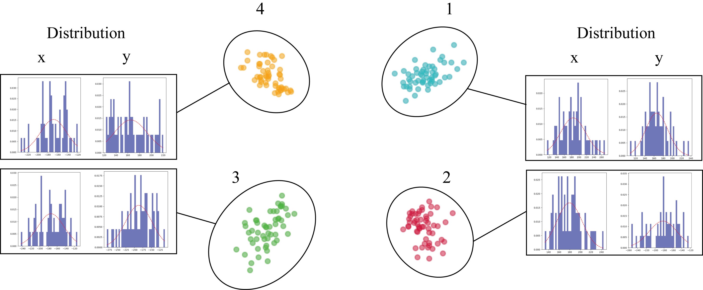

# User Experiments of Pattern Lock

## Introduction

Screen locks often bring about problems about decreasing efficiency, since we might need to deal with complicated passwords as accessing our cellphones. According to a survey conducted by Apple in 2016, users open their mobile phone about 80 times per day on average. The overhead caused by unlocking is undesirable, and as a result, this project aims to minimize the unlocking time and design a faster approach to activate applications on smart phones. We conducted three analyses of user's habits and came upon an one-step-way method that people could unlock and activate apps on the main page without extra accessing and loading time. Also, this concept is applicable. Cellphones with a pattern lock, a fingerprint lock or a face recognition lock can be applied to this setting. We conducted the following experiments on android smart phones. Detailed discussion about the experimental results and subject's behavior is shown below.

## Method

We designed a set of experiments, including three sub-parts, which are aimed at the landing habit, the error rate, the time to finish the corresponding test. The implementation details are shown below:

#### Recruitment of subjects

A total of 11 subjects were recruited, 6 women and 5 men. All 11 subjects have used smart phones for more than 5 years. They have no discomforts in the hands, and are all right-handed.

#### Experiment 1

This experiment will evaluate the landing points of the subjects. The experimental variables are the position of target apps and the layout of the bounce window after long pressing. The control amount is the pattern, the firing time, the app graphic size and the distance, and the dependent variable is the landing position.

#### Process and details

The subjects will be informed to use their dominant thumb to slide over the screen and they are allowed to use the left hand as support to hold the cellphone. The followings will be informed before the experiment begins:

```
1. The pattern is 36987452.
2. When the fixed point (2) is reached, you must hold it for 0.5s, and a box will pop out.
3. After the icon frame pops out, move your finger onto the target-app icon and release it.
4. Please note that the target pattern will change its position every five times. It will not be timed. Please give priority to accuracy.
```

We will record the landing positions of different configurations (configuration 1 and 2 for 4 types, configuration 3 and 4 for 6 types), position of fingers' release (5 times) according to different targeted apps (4 types in total), so the subject will undergo 4\*4\*5\*2+4\*6\*5\*2=400(times) tests at this stage. The experiment takes about 7 minutes.


#### Experiment 2

This experiment will evaluate the subject's intention to unlock by checking the pressing time to activate the bounce window. Obviously, the experimental variable is the holden time. The controlled variable is the path of the pattern lock while the dependent variable is the error rate.

#### Process and details

The subjects will be informed to use their dominant thumb to slide over the screen and they are allowed to use the left hand as support to hold the cellphone. The followings will be informed before the experiment begins:

```
1. The lock must be opened with one hand, case 36987452.
2. When you reach the specified point, you must hold on for a certain time.
3. It will automatically restart.
4. It will not be timed. Please give priority to accuracy.
```

It will record the time required to open the pattern lock. 10-time tests with different pause time (a total of 6 types) will be conducted. The subject will go through 6\*10=60 tests. It takes about 4 minutes.


#### Experiment 3

We aim to compare the time difference to open a certain app between using our method and the usual way. The experimental variables are the mode after unlocking, the location of the target app, and the layout of the bounce window after long press. The controlled variables are the layout of the bounce window, the activating time, the size and distance of the the app icon. The dependent variable is the operation time.

#### Process and details

Similarly, the subjects will be informed to use their dominant thumb to slide over the screen and they are allowed to use the left hand as support to hold the cellphone. The followings will be informed before the experiment begins:

```
1. The pattern lock must be opened with one hand. (36987452).
2. The experiment is divided into two stages, each of which will have a 3 second preparation time.
3. After starting, you must open the pattern lock at the fastest speed.
4. The first stage is an analog phone stage. Please click it in the customary way.
5. The second stage is the experiment stage. The subject must press and hold to activate the app.
6. The target position is randomly generated, please pay attention and not to hurry. Correctness is the first priority.
```

It will record the time required to open the pattern lock (5 times) under different configurations (two general configurations, four experiments), different app positions (random), so the subject will experience 1\*4\*5+1\*6\*5+2\*4\*5+2\*6\*5=150 tests. The experiment takes about 8 minutes.



## Results

In this section we will analyze the results of the three experiments and discuss their significance.

#### Experiment 1

First, we aim to analyze the user's habits according to the coordinate points collected. The following figures show the points (after removing the abnormal points) on the first experimental setting (90 degrees, 0 degrees, -90 degrees, 180 degrees), and the red line in the distribution chart represents the Gaussian distribution while the purple bars represent the actual distribution.


From the table above, observation tells us that even if the graphics is the same in aspect of ratio, size, and distance, there is still an inaccurate click, and this distribution is closely related to the direction of finger movement. For the target position 1, the center point is located at (0, 200), but the average value falls at (-0.4906, 222.0566). That is, users tend to release their fingers north when they move the fingers upward.

The difference in standard deviation is also noteworthy. In the vertical axis of Table 1, the x-coordinate standard deviations can obviously be divided into two parts. The first block is the part of the target position 1 and 3, Their standard deviations are 22.0391 and 18.8988 respectively; while the second block is the part of the target position 2 and 4, their standard deviations are 31.5921 and 28.0826 respectively. The experimental configurations 2 and 4 relying on the longitudinal movement of fingers yielded large standard deviations in the x coordinate, and by the same token, we can find that the experimental configurations 1 and 3 relying on the lateral movement of fingers yielded large standard deviations in the y coordinate. This shows that the user's dragging position is closely related to the moving direction, or more precisely, the landing point will be divergent in the x-axis direction as the finger moves horizontally, and similarly, the landing point will be in the y-axis as the finger moves vertically.

To sum up, we found that deviation in the dragging task is closely related to the moving direction of the finger. Also, there will be a large standard deviation in the direction of movement.




Similar phenomonon occured in the following experiments (3,4).


Due to the limitation of hands' movement, the points are denser at about -30 degree of the 6 configurations. In addition, we compared the Eulidean distance between the ground truth positions and the landing points. In configuration 3, the distances are: *27.3790*、44.3147、46.1790、51.2296、*53.8679*、43.0804. In configuration 4, the distances are: 46.5546、41.0050、51.0400、*69.6366*、44.2386、*35.4826*. Astonishingly, some deviations are twice as the others, which also indicates that our finger movement follows a certain pattern by which we could trace or predict potential landing points. That could definitely help us to construct one-hand operation settings.


#### Experiment 2

On the second experiment, we are going to determine the intention to long press. It is the trade-off between efficiency and correctness that makes this experiment indispensible, since too much the time to be recognized as a long-press makes the operation inefficient, while too less the time makes error rate incredibly high. To strike a balance, we recorded the error rate while the subjects were trying to long press. We adopted 6 different thresholds--0.100, 0.135, 0.170, 0.205, 0.240, 0.275 second respectively--and the results are shown below:


Obviously, 0.24 second is the knee point and we picked it as the time required for users' intention for long pressing.

#### Experiment 3

On the thrid experiment, we are going to find out the required time for our method and usual method to unlock and activate apps. The graph below shows the difference:


The differences in time (3.8%、3.3%、2.5%、1.7%) between the two settings are not significant. Further, we think that the decreasing trend of the percentage of differences is, less or more, related to the subjects’ familiarity toward the tasks. The subjects might be more adroit at the task with similar settings on the afterward experiments so they took less time on the tasks.


## Conclusion

We designed a set of experiments to help us understand users' behavior on pattern locks. Also, we conducted experiments on landing points, responsive time and operation time. Although the outcomes indicated our failure on reducing the operation time, I believe those results could be useful in the study of one-hand operation.
